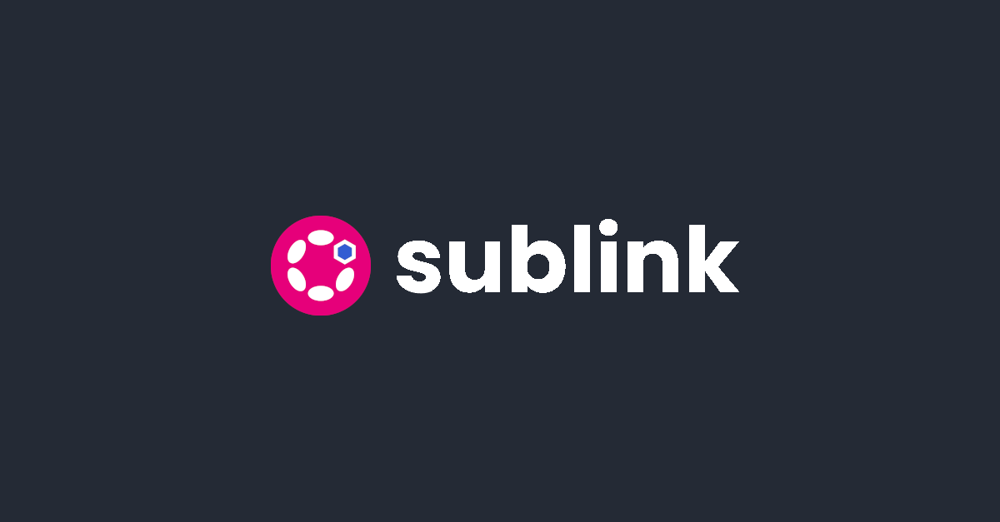

A [Substrate](https://substrate.io/) Parachain connected to [Chainlink](https://chain.link/) nodes, to bring accurate price feeds to [ink!](https://paritytech.github.io/ink-docs/) contracts and others parachains.

Personal project for the [Chainlink Spring 22 Hackathon](https://chain.link/hackathon).

## Inspiration

During my first [Chainlink Hackathon](https://devpost.com/software/ki-dot-a-substrate-based-blockchain-to-help-micro-funding) in 2020, I had to setup, debug and update the existing [ChainLink Polkadot bridge](https://github.com/smartcontractkit/chainlink-polkadot).

It was not so easy, and it seems that things did not change very much, and it's still very difficult and tedious to connect Chainlink nodes to a Substrate chain.

Maybe that's why no Polkadot/Kusama parachain is using Chainlink as an Oracle in 2022... _(well I did not find any)_

Maybe it's time to change that, and use the power of native cross chain messaging and parachains specialization to bring accurate price feeds to Substrate in a simpler way.

That's what the SubLink project is about :)

## What it does

SubLink is a substrate parachain, connected to some Chainlink nodes, and configured to retrieve and store asset price (aka [Price feeds](https://docs.chain.link/docs/using-chainlink-reference-contracts/)) from these nodes. The bridge configuration between Chainlink nodes and the parachain is done only for the SubLink parachain.

As a parachain, SubLink is able to send these price feeds to others parachains connected to the same relay chain. This is done through the exchange of messages following the [XCM format](https://wiki.polkadot.network/docs/learn-crosschain), and the others parachains don't need to get connected to any Chainlink nodes.

SubLink is also able to provide the price feeds inside ink! smartcontracts, using a dedicated ink! chain extension. This way, getting a token price value is as easy as doing it [with Solidity](https://docs.chain.link/docs/get-the-latest-price/#solidity).

## How I built it

### Play with the Chainlink Price feeds pallet

### Convert my local chain to a parachain

### Get price feeds in ink! contract

### Implement cross chains messaging for price feeds

### Get price feeds in ink! contract but through XCM

### Putting all things together online

Well, this project needs a lot of elements to get the simpliest use case ready :

    - At least one chainlink node with 3 jobs to get prices from 3 different sources
    - The relay chain with 2 validators
    - The SubLink parachain with 2 collators
    - The Defi Example parachain with one collator
    - A custom Polkadot JS apps that displays only the 3 chains
    - A custom Contracts UI application to connect to the Defi Example parachain
    - We need 3 differents Substrate Adapters to update prices on the SubLink chain from these 3 jobs
    - An external initiator to trigger Chainlink jobs
    - An Nginx reverse proxy to rule them all
  
All these elements have been deployed in a cloud [Kubernetes](./k8s/) cluster.

### Technical overview

## Challenges I ran into

The main challenge I faced was the time constraint, as I started the hackathon a little bit too late, with only a couple of spare time days.

So I had to do it quickly, and had to make numerous shortcuts and hacky workarounds :(

## What I learned

## What's next for SubLink

