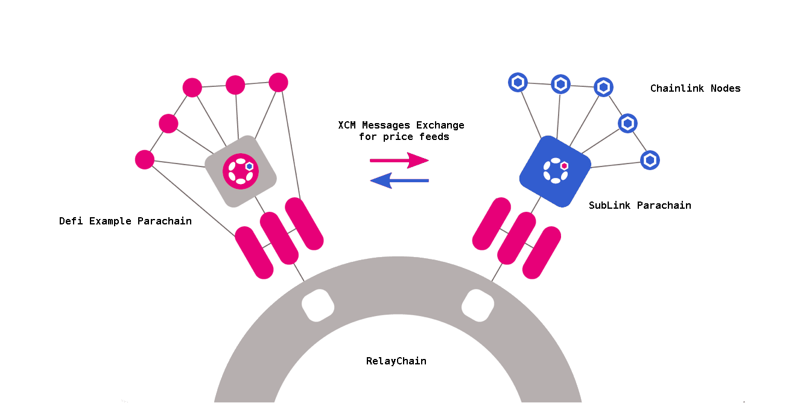

A [Substrate](https://substrate.io/) Parachain connected to [Chainlink](https://chain.link/) nodes, to bring accurate price feeds to [ink!](https://paritytech.github.io/ink-docs/) contracts and others parachains.

Personal project for the [Chainlink Spring 22 Hackathon](https://chain.link/hackathon).

> **Disclaimer**: This project is a hackathon project, and should be treated as is. It obviously cannot be used in production.
## Inspiration

During my first [Chainlink Hackathon](https://devpost.com/software/ki-dot-a-substrate-based-blockchain-to-help-micro-funding) in 2020, I had to setup, debug and update the existing [ChainLink Polkadot bridge](https://github.com/smartcontractkit/chainlink-polkadot).

It was not so easy, and it seems that things did not change very much, and it's still very difficult and tedious to connect Chainlink nodes to a Substrate chain.

Maybe that's why no Polkadot/Kusama parachain is using Chainlink as an Oracle in 2022... _(well I did not find any)_

Maybe it's time to change that, and use the power of native cross chain messaging and parachains specialization to bring accurate price feeds to Substrate in a simpler way.

That's what the SubLink project is about :)

## What it does

SubLink is a substrate parachain, connected to some Chainlink nodes, and configured to retrieve and store asset price (aka [Price feeds](https://docs.chain.link/docs/using-chainlink-reference-contracts/)) from these nodes. The bridge configuration between Chainlink nodes and the parachain is done only for the SubLink parachain.

As a parachain, SubLink is able to send these price feeds to others parachains connected to the same relay chain. This is done through the exchange of messages following the [XCM format](https://wiki.polkadot.network/docs/learn-crosschain), and the others parachains don't need to get connected to any Chainlink nodes.

SubLink is also able to provide the price feeds inside ink! smartcontracts, using a dedicated ink! chain extension. This way, getting a token price value is as easy as doing it [with Solidity](https://docs.chain.link/docs/get-the-latest-price/#solidity).

## How I built it

### Play with the Chainlink Price feeds pallet

Since 2020, the Chainlink Polkadot bridge has been enhanced to include a [pallet dedicated to price feeds](https://github.com/smartcontractkit/chainlink-polkadot/tree/master/pallet-chainlink-feed).

I dedicated some time to understand, update and experience this new pallet, and to get my first price feed updated on a substrate node.

> **Workaround**: As I didn't manage to get the external initiator to work, I had to reproduce its behaviour in a very quick and dirty NodeJS script in order to trigger jobs in Chainlink Nodes.
> My initial plan was to use Offchain workers, but it seems that they are [not working in parachains](https://substrate.stackexchange.com/questions/2597/offchain-workers-in-parachain) _(well I didn't succeed)_

### Convert my local chain to a parachain

As I needed cross chains messaging, I had to [convert my local chain to a parachain](https://docs.substrate.io/how-to-guides/v3/parachains/convert/), and setup a [relay chain](https://docs.substrate.io/tutorials/v3/cumulus/start-relay/) to connect to.

### Get price feeds in ink! contract

My ultimate goal was to get price feed in ink! smartcontract, so I decided to first check I will be able to do it on my new parachain before introducing XCM.

I looked at some examples of ink! chain extension on GitHub to learn how this thing work, and build a minimalist chain extension to bridge the Chainlink Price feed pallet to ink! contract.

### Implement cross chains messaging for price feeds

With the use of [this tutorial](https://medium.com/oak-blockchain/tutorial-polkadot-cross-chain-message-passing-xcmp-demo-with-ping-pallet-f53397158ab4), I crafted a new SubLink XCM pallet to deal with message exchange to carry price request and values.

I added a second parachain (Defi Example Parachain) to be able to test this new pallet, and exchange price feeds between this parachain and the SubLink parachain.

### Get price feeds in ink! contract but through XCM

The final step was to use the previous ink! chain extension in the Defi Example Parachain: instead of using the Chainlink pallet, the extension relies on a SubLink Parachain Oracle that exposes the same interface of the Chainlink Pallet, but uses the SubLink XCM pallet to get the price feeds from the SubLink parachain.

### Putting all things together online

Well, this project needs a lot of elements to get the simpliest use case ready :

- At least one chainlink node with 3 jobs to get prices from 3 different sources
- The relay chain with 2 validators
- The SubLink parachain with 2 collators
- The Defi Example parachain with one collator
- A custom Polkadot JS apps that displays only the 3 chains
- A custom Contracts UI application to connect to the Defi Example parachain
- We need 3 differents Substrate Adapters to update prices on the SubLink chain from these 3 jobs
- An external initiator to trigger Chainlink jobs
- An Nginx reverse proxy to rule them all
  
All these elements have been deployed in a cloud [Kubernetes](./k8s/) cluster.

### Technical overview

## Challenges I ran into

The main challenge I faced was the time constraint, as I started the hackathon a little bit too late, with only a couple of spare time days.

So I had to do it quickly, and had to make numerous shortcuts, hacks and workarounds :(

Technical challenges were related to the use of new Substrate features like XCM and ink! chain extensions.

## What I learned

To do :)

## What's next for SubLink

To do :)